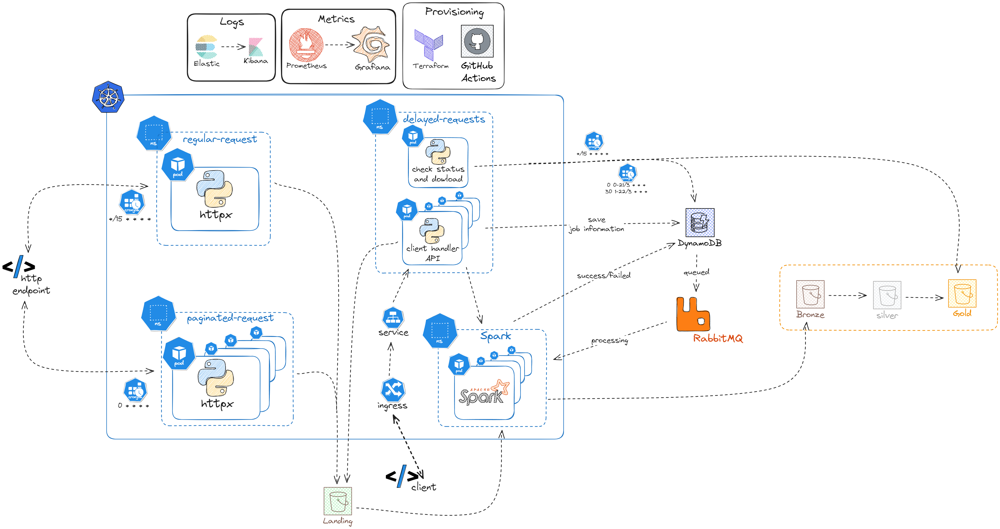

# System architecture


## Environment

1 - To achieve horizontal scalability, the main components are deployed inside kubernetes

2 - Each solution resides in its own namespace: regular-request, paginated-requests, delayed requests, spark

## Global Assumptions

It's assumed that the external endpoints will respond fast enough to meet our 100ms requirements. Any time above that can't be considered a system design fault, because there're many external factors that could delay the response.

## 1 - Regular Requests
- There's a cronJob on kubernetes that will trigger each 15 minutes to consume the API and store the results in a S3 bucket. Since this event will occur only each 15 minutes, there's no need to have more than 1 pod/container.
- Httpx is a low-latency Python library that can hadle that kind of workload 

## 2 - Paginated Requests
Suppose the first call to the API will return all pagination links (up to 1000). After reading the pages, we can:
- Use a single pod that retrieve the paginated links and create 1 pod for each requested page, using the kubernetes python Library, achieving parallelism.

## 3 and 4 - Delayed Requests and Data Push

#### Components
- We have dynamoDB storing the information about the processing workload.
- There's a RabbitMQ queue for ordering the events
- There're spark containers to process the data, using kubernetes operator.
- There'll be an Ingress / Load Balancer inside kubernetes that will distribute workload across 10 different client handler API pods, making it resilient enough to handle 1000 clients requests.
- Client handler API can also check for job statuses

#### Workflow
- When the request is made, client handler API will save job information in DynamoDB, add it to a RabbitMQ queue and start a SparkJob inside sparkoperator namespace. There's no limit for that, each request will create a single job inside 1 container to achieve parallelism and efficiency. 
- The queue will be then consumed by the server processing (Spark Jobs) in the order it arrived. Right after the job starts, it'll then update the status to "processing". After processing and saving the data in the datalake, the job will update dynamoDB with status "success" or "failed". If the job takes more than 15 minutes to complete, it will be marked as "failed".
- Whenever clients need to push data, the data will be added to a S3 bucket so spark can process it later.
- Each 90 minutes, there'll be a job that checks what's already processed from the last 90 minutes in DynamoDB. All jobs that are marked as "success" will be downloaded and marked as "downloaded". To achieve the 90 minutes goal, 2 cronJobs need to be used:
    ```python 
    0 0-21/3 * * *
    30 1-22/3 * * *
    ```
- There'll be a job that will look into a 15 minutes time-window to check whether the processing jobs are marked as "success". If they aren't, all jobs will be added again to the queue to retry one last time. If the job takes again more than 15 minutes to re-process, it'll be marked as "failed". The same job can be used to download the report and verify the request's completion or failure.

#### DynamoDB document
Below is the DynamoDB document for the life cycle management
```json
{
    "retries": 0-1,
    "status": queued | processing | success | failed | downloaded,
    "created_at": timestamp,
    "job_id": <string>,
    "report_file_path": <string>,
    "files_to_process": [<string>]
}
```

- retries: It's used for stop trying to re-process. Defaults to 0
- status: processing status. Defaults to queued
- created_at: When the job was created. Used for comparisson when checking statuses
- job_id: job identifier. Can't be null
- report_files_path: where in s3 the report can be found. Defaults to null
- files_to_process: array of strings for files that need to be processed

## Bonus
- Prometheus can be deployed inside kubernetes to collect metrics from our infrastructure and later create Dashboards and alerts in Grafana to understand which resources we can scale and resize. Understanding these behaviours can save us a lot of money and constantly meet high availability requirements
- Elastic can be deployed to collect logs from our aplication so we can later debug, find issues and improve our ecosystem. Logs can be later explored in Kibana
- Infrastructure can be deployed using terraform, and Github actions can be used to automate the process


# Running the code
To take a look into the code solutions, follow the steps above:

- Clone this repository
    ```bash
    git clone git@github.com:jfrsbg/http-request-k8s.git
    ```
- enter inside project
    ```
    cd http-request-k8s
    ```
- install poetry
    ```bash
    pip install poetry
    ```
- install the project
    ```
    poetry install
    ```
- activate the virtual env
    ```
    source .venv/bin/activate
    ```
- execute the mock-api, which will generate random data so api_request.py can consume it
    ```
    python3 mock-api.py
    ```

- open another terminal and load the enviroment again
    ```
    source .venv/bin/activate
    ```
- Now run the consumer
    ```
    python3 api_request.py
    ```

After doing it all, you'll see an output in your terminal to get a sample of the data that was downloaded. Inside your current directory, you'll see a file called "report.csv" that contains all the consumed data.

This script can also be used to do the following:
- make an API request
- consume the API's results and write an csv file in a s3 bucket
- use AWS Athena or Trino to query saved data and plug it later in a Dashboard like Tableau, Looker, Quicksight, PowerBI, Apache Superset or Metabase. 